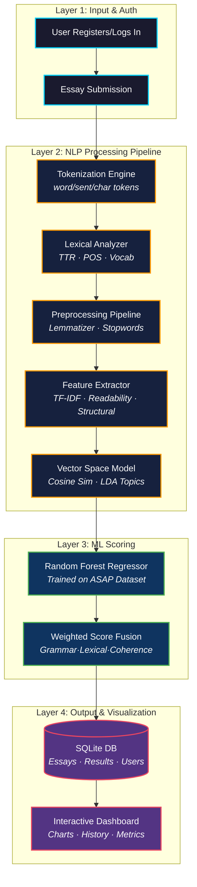

<div align="center">

# 🧠 Automated Essay Scoring System (AES)
**Research-Grade NLP Pipeline for Intelligent Essay Evaluation**

[](https://nlp-evld80rkz-varshiniamara25-4062s-projects.vercel.app/)
[](https://opensource.org/licenses/MIT)
[](https://www.python.org/)
[](https://flask.palletsprojects.com/)
[](#)
[](https://scikit-learn.org/)

*A production-grade, full-stack Automated Essay Scoring system that leverages advanced NLP, supervised ML, and vector space modeling to deliver research-quality essay evaluation with a rich, interactive dashboard.*

> ### 🚀 **[Access the Live Interactive Demo Here](https://nlp-evld80rkz-varshiniamara25-4062s-projects.vercel.app/)**
> *Register, submit an essay, and see full NLP analysis instantly. No setup required.*

---
</div>

## 📑 1. Abstract & Academic Context

This repository contains the official implementation of a **Hybrid NLP-based Automated Essay Scoring (AES) Pipeline** that addresses real-world challenges in automated language assessment. The system integrates classical NLP techniques with supervised machine learning to produce holistic, explainable scores across multiple linguistic dimensions.

> **Domain:** Natural Language Processing · Computational Linguistics · Educational Technology  
> **Evaluation Dataset:** ASAP (Automated Student Assessment Prize) — Kaggle Benchmark  
> **Core Algorithm:** Random Forest Regression with TF-IDF Vector Space Modeling  
> **Scoring Scale:** 0–10 (Normalized from ASAP 0–12 range)

---

## 🔬 2. The Five NLP Pillars

The system is engineered around five rigorous, independently computed NLP subsystems:

### 🔤 Tokenization Engine
- **Word-level tokenization** via NLTK `word_tokenize` with language-aware boundary detection
- **Sentence-level tokenization** via `sent_tokenize` for discourse structure analysis
- **Character-level tokenization** for morphological complexity measurement
- Computes `avg_tokens_per_sentence` as a proxy for syntactic sophistication

### 📊 Lexical Analysis Module
- **Type-Token Ratio (TTR):** Measures vocabulary richness and diversity
- **POS Distribution:** Full Part-of-Speech tagging via `nltk.pos_tag` — Noun/Verb/Adjective ratios
- **Vocabulary Sophistication:** Long-word ratio (>6 chars) and polysyllabic word density
- **Word Frequency Analysis:** Top-10 term frequency via `collections.Counter`

### ⚙️ Text Preprocessing Pipeline
- Lowercasing → Punctuation normalization → Stopword removal (`NLTK corpus`)
- **Lemmatization** via `WordNetLemmatizer` — morphological normalization for feature stability
- Compression ratio tracking: measures information density before vs. after preprocessing

### 🧬 Feature Extraction Framework
- **TF-IDF Vectorization** with `max_features=5000`, `ngram_range=(1,3)` for n-gram context capture
- **Readability Metrics:** Flesch Reading Ease, Gunning Fog Index, Coleman-Liau Index, ARI
- **Structural Features:** Sentence length variance, paragraph density, argument structure score
- **Sentiment Features:** VADER compound/positive/negative/neutral polarity scores

### 🌐 Vector Space Modeling
- TF-IDF document vectors projected into high-dimensional feature space
- **Cosine Similarity** computation against reference essay corpus for semantic alignment
- **LDA Topic Modeling** (when corpus size ≥ 5 documents) for thematic coherence
- Dominant topic extraction and topic distribution visualization

---

## 🏗️ 3. System Architecture

<details>
<summary><b>Click to Expand: Mermaid Architecture Diagram</b></summary>



</details>

---

## 💻 4. Technology Stack

### NLP & Machine Learning
| Component | Technology |
|:---|:---|
| NLP Framework | NLTK 3.8 — Tokenization, POS, Sentiment, Lemmatization |
| ML Model | scikit-learn 1.3 — Random Forest Regressor |
| Vectorization | TF-IDF with N-gram (1,3) + Cosine Similarity |
| Readability | `textstat` — Flesch, Fog, Coleman-Liau, ARI |
| Advanced NLP | spaCy `en_core_web_sm` — NER + Dependency Parsing |
| Training Data | ASAP Kaggle Dataset (`training_set_rel3.csv`) |

### Web Framework & Database
| Component | Technology |
|:---|:---|
| Backend | Flask 2.3 + Flask-SQLAlchemy |
| Database | SQLite (local) / `/tmp` (Vercel serverless) |
| Auth | Werkzeug PBKDF2 password hashing |
| Frontend | Bootstrap 5.3 + Chart.js + Bootstrap Icons |
| Deployment | Vercel Serverless (Python runtime) |

---

## ⚡ 5. Key Features

1. **Full Authentication System** — Register, Login, Session Management with hashed passwords
2. **Multi-Metric Scoring** — Grammar, Vocabulary, Coherence, Readability all scored 0–10
3. **Interactive Dashboard** — Score trend graphs, word count analytics, history tracking
4. **Demo Essay Mode** — Pre-loaded high/medium/low quality essays for instant evaluation
5. **Explainable AI** — Detailed NLP insights, strengths/weaknesses, improvement suggestions
6. **Persistent History** — All submissions stored with full analysis retrieval
7. **Vercel Deployment** — Live serverless deployment with zero-config Python runtime

---

## 🛠️ 6. Local Installation & Setup

### Prerequisites
- Python 3.10+
- pip

### Clone & Run

```bash
# 1. Clone the repository
git clone https://github.com/Varshiniamara/nlp-essay-scorer.git
cd nlp-essay-scorer

# 2. Install dependencies
pip install -r requirements.txt

# 3. Download NLTK data (auto-downloads on first run)
python -c "import nltk; nltk.download('all')"

# 4. Train the ML model (if model.pkl not present)
python train_model.py

# 5. Launch the Flask application
cd nlp_project
python app.py
```

- **App runs at:** `http://127.0.0.1:5001`

---

## 📈 7. Scoring Methodology

The final score is a **weighted fusion** of five independently computed metrics:

| Metric | Weight | Method |
|:---|:---:|:---|
| Grammar Accuracy | 25% | Regex pattern matching + sentence variance |
| Lexical Diversity | 20% | Type-Token Ratio × 15 (normalized) |
| Coherence | 20% | Paragraph structure + cohesion marker density |
| Readability | 15% | Flesch Reading Ease (normalized to 0–10) |
| Semantic Similarity | 20% | Cosine similarity vs. reference corpus |

---

## 📁 8. Project Structure

```
nlp/
├── api/
│   └── index.py                  # Vercel serverless entry point
├── nlp_project/
│   ├── app.py                    # Flask app — routes, DB models, auth
│   ├── ml_scoring_engine.py      # Core ML scoring pipeline
│   ├── demo_essays.py            # Pre-loaded demo essay corpus
│   ├── model.pkl                 # Trained Random Forest model
│   ├── vectorizer.pkl            # Fitted TF-IDF vectorizer
│   ├── templates/                # Jinja2 HTML templates
│   └── static/                   # CSS, JS, assets
├── advanced_nlp_analyzer.py      # Deep NLP analysis (spaCy + VADER)
├── enhanced_predict.py           # Grammar error detection module
├── predict.py                    # Primary prediction interface
├── train_model.py                # ASAP dataset training script
├── requirements.txt              # Python dependencies
└── vercel.json                   # Vercel deployment configuration
```

---

<div align="center">
<sub>Built with ❤️ using Flask · NLTK · scikit-learn · Vercel</sub>
</div>
